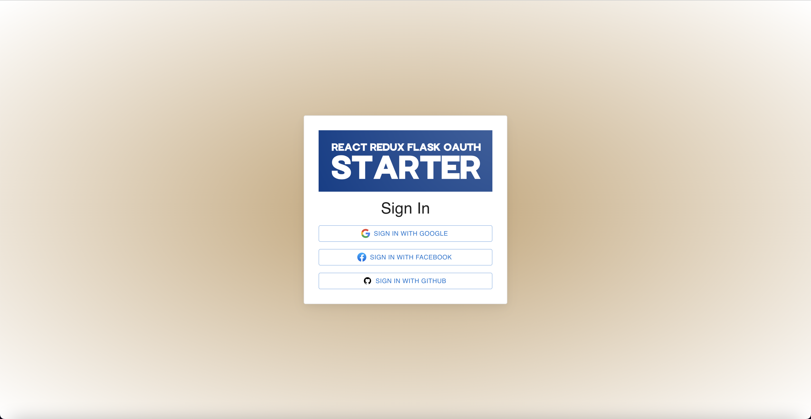
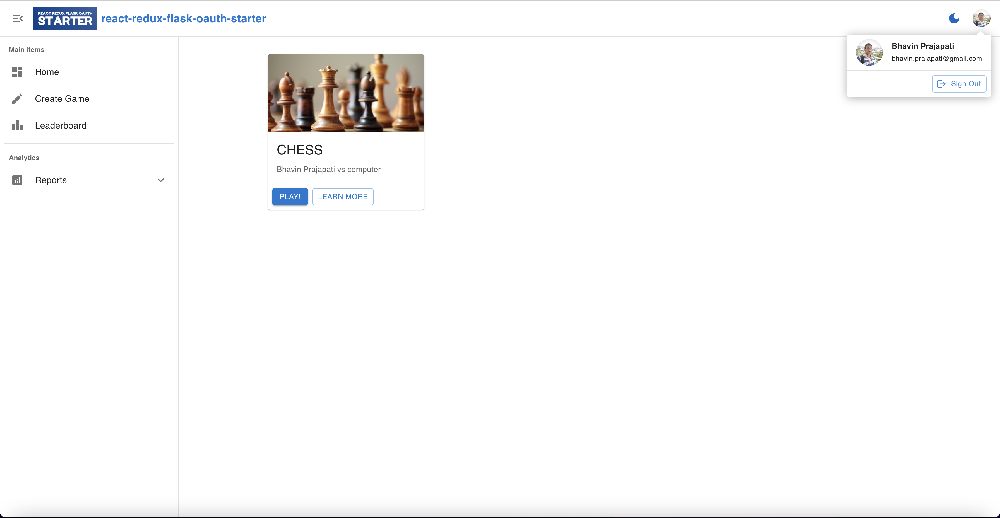

# react-redux-flask-oauth-starter
A Starter Kit for React, Redux and Flask with Social Media login integrated

## Quick start
```sh
docker-compose build
docker-compose up
```

## Signin Page


## Dashboard Page


## Game Page


## Redis Docker Image

* [redis-stack-server](https://hub.docker.com/r/redis/redis-stack-server)

## Client-side Libraries

* [React](https://react.dev/)
* [Redux Toolkit](https://redux-toolkit.js.org/)
* [Material UI](https://mui.com/material-ui/)
* [Toolpad](https://mui.com/toolpad)

## Server-side Libraries

* [flask](https://flask.palletsprojects.com/en/stable/)
* [flask-dance](https://flask-dance.readthedocs.io/en/latest/index.html)
* [redis-py](https://pypi.org/project/redis/)

## License

This source code is licensed under the GPL-3.0
license found in the [LICENSE](https://github.com/bhavin-prajapati/react-redux-flask-oauth-starter/blob/main/LICENSE)
file.
